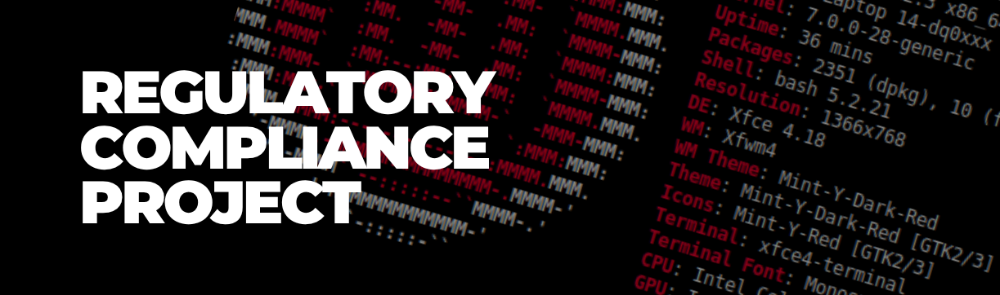
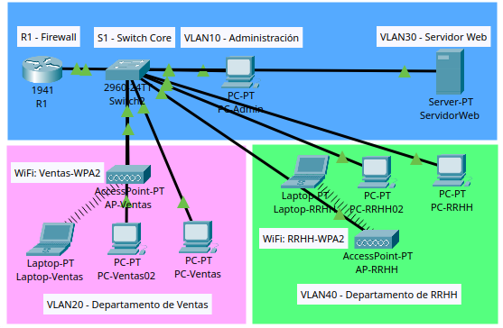

# Proyecto: Segmentación de Red para Cumplimiento Normativo 📖

## por: Eleonor A.H. (@leonXxit0)

> **Sobre Mí:** Soy abogada con experiencia en **PYMEs, gestión de proyectos y relaciones públicas**. Mi trayectoria profesional se centra en la consultoría legal, negocios y el cumplimiento normativo de personas jurídicas. Lo que me diferencia es mi capacidad para tender puentes entre el **Derecho** y la **Tecnología**. He complementado mi formación legal con estudios técnicos en **redes IP y ciberseguridad**, lo que me permite comprender los riesgos tecnológicos y traducirlos al lenguaje legal que las empresas necesitan para protegerse.

---

### 📌 Objetivo:

Diseñar e implementar una arquitectura de red corporativa segura, aplicando el principio de **"Mínimo Privilegio"** y **"Privacidad por Diseño"**, alineada con los estándares internacionales de ciberseguridad y protección de datos.

### ¿Qué hice?

Utilizando **Cisco Packet Tracer**, diseñé y configuré una red local (LAN) para una oficina con 3 departamentos. Para garantizar la **confidencialidad** de los datos, segmenté el tráfico mediante **VLANs** (redes virtuales) y configuré un **firewall perimetral (ACLs)** que controla quién puede comunicarse con quién dentro de la organización.

### ¿Por qué es importante?

Este proyecto demuestra mi capacidad para **traducir un requisito legal en una configuración técnica**. La segmentación de la red no es solo una "buena práctica informática"; es una **medida técnica exigida por normativas internacionales**:

| Normativa | Artículo / Anexo | Requisito que cumple |
| :--- | :--- | :--- |
| **GDPR (UE) 2016/679** | Art. 25 y 32 | "Privacidad por Diseño" y medidas técnicas para garantizar la seguridad de los datos. |
| **ISO 27001:2022** | Anexo A.8.22 | Segregación de redes: separar sistemas según el riesgo para controlar el flujo de tráfico. |
| **Directiva NIS2 (UE) 2022/2555** | Art. 21.2 | Medidas de gestión de riesgos de ciberseguridad (control de acceso, seguridad de redes). |

**Al aplicar estos controles, la organización puede:**

1.  **Mitigar el riesgo de filtración de datos:** Limitando el acceso solo al personal autorizado.
2.  **Cumplir con el principio de "Privacidad por Diseño":** Integrando la seguridad en la arquitectura desde el inicio.
3.  **Reducir la superficie de ataque:** Aislando el servidor web y protegiéndolo de accesos no autorizados.
4.  **Demostrar "Responsabilidad Proactiva":** Contar con evidencia técnica de que se han implementado medidas de seguridad exigidas por ley.

---

### 💻 Captura de la Red

*Figura 1: Vista lógica de la red corporativa segmentada. Cada departamento opera en su propia VLAN, aislada del resto. El router central aplica políticas de firewall (ACLs) para controlar el tráfico entre VLANs.*

---

### 📄 Documentación

📎 [Descargar Informe Ejecutivo en (.pdf)](./Informe-Ciberseguridad.pdf)
*(Incluye análisis de riesgos, implicaciones legales y referencias normativas).*

📎 [Descargar Archivo de Simulación (.pkt)](./Proyecto-ciberseguridad.pkt)  
*(Para visualizar la configuración en Cisco Packet Tracer).*

---

## 🛠️ Habilidades

- **ASESORÍA LEGAL CORPORATIVA:** Gestión integral del ciclo de vida del negocio, desde la constitución hasta la operatividad comercial, asegurando el cumplimiento normativo y la protección de activos.
- **LEGAL FINDER E INTELIGENCIA NORMATIVA:** Monitoreo y análisis exhaustivo de Gacetas Oficiales y boletines legales. Elaboración de resúmenes ejecutivos y opiniones legales sobre tendencias jurídicas actuales.
- **RECOLECCIÓN Y ANÁLISIS DE DATOS:** Elaboración de formularios de Google, curación de datos a través de Excel/PowerBI, y elaboración de dashboards en Excel/PowerBI.
- **INVESTIGACIÓN PROFUNDA:** Búsqueda avanzada de información pública con metodología OSINT y Google Search Operators.
- **ARQUITECTURA DE RED Y CIBERSEGURIDAD:** Comprensión de principios de segmentación de red (VLANs), control de accesos (firewalls/ACLs) y su aplicación para cumplir con normativas de protección de datos y ciberseguridad (GDPR, NIS2, ISO 27001).

---

## 🏆 Reconocimientos y Participaciones

- **Reconocimiento por ICAC:** Ponencia internacional sobre la IA aplicada al Derecho (Perú, 2025).
- **Reconocimiento por la Universidad de El Salvador:** Ponencia internacional "IA aplicada al Derecho" (El Salvador, 2025).

---

### Artículos Publicados

- **"IA: El Final Boss de la Geopolítica Moderna"**  
  Análisis de normativa y política exterior de Estados Unidos y China en temas de desarrollo de la inteligencia artificial.  
  [Leer más](https://chicasenrrii.com/ia-hegemonia-tecnologica-geopolitica/)

- **"La Innovación Legal y la Inteligencia Artificial: ¿Cómo la Transformación Digital Puede Generar Discriminación Algorítmica y Vigilancia Masiva en el Sector Público?"**  
  La digitalización con IA en el sector público y privado plantea riesgos de discriminación algorítmica y vigilancia masiva. Se aborda la necesidad de regulaciones que equilibren innovación y derechos humanos para una transformación digital justa y segura.  
  [Leer más](https://www.researchgate.net/publication/390438188_LA_INNOVACION_LEGAL_Y_LA_INTELIGENCIA_ARTIFICIAL_COMO_LA_TRANFORMACION_DIGITAL_PUEDE_GENERAR_DISCRIMINACION_ALGORITMICA_Y_LA_VIGILANCIA_MASIVA_EN_EL_SECTOR_PUBLICO)

---

## 📬 Contacto

📧 [elarhuaa@gmail.com](mailto:elarhuaa@gmail.com)
